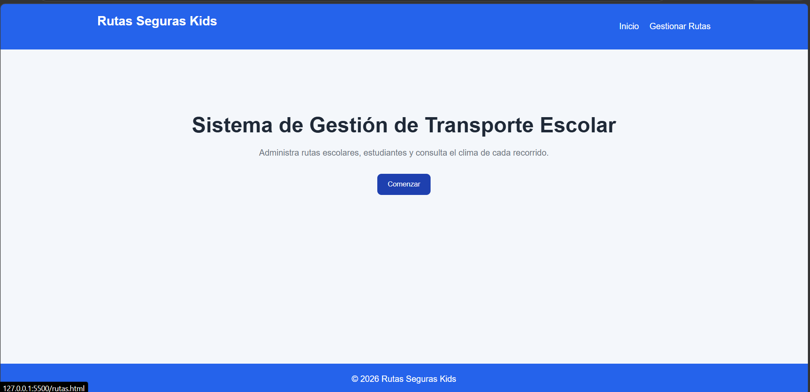
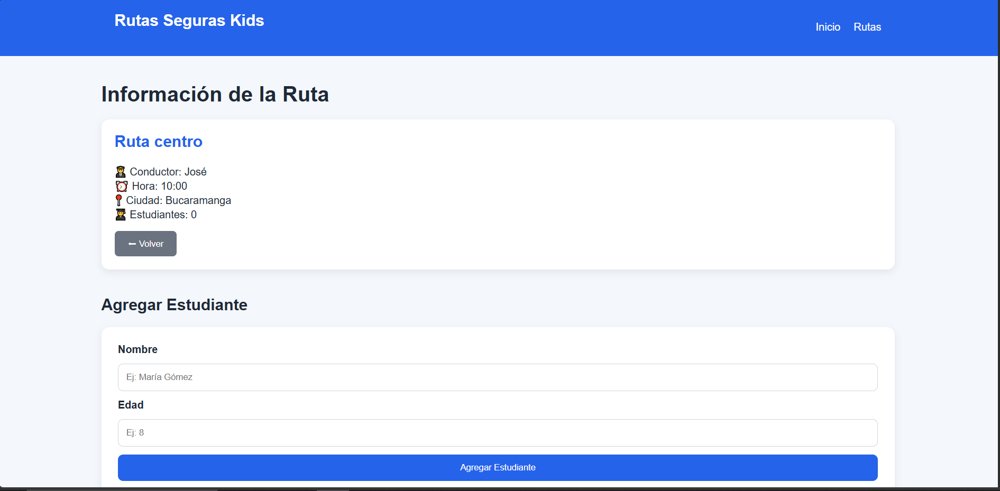

# 🚌 Rutas Seguras Kids

Sistema de gestión de transporte escolar que permite organizar rutas, asignar estudiantes y consultar el clima en tiempo real.

---

## 📋 Descripción del Proyecto

**Rutas Seguras Kids** es una aplicación frontend desarrollada con **HTML, CSS y JavaScript puro** que permite:

- ✅ Crear, editar y eliminar rutas escolares
- ✅ Asignar estudiantes a cada ruta
- ✅ Visualizar el clima en la ciudad de la ruta (OpenWeather API)
- ✅ Interfaz responsive y amigable
- ✅ Web Components con Shadow DOM
- ✅ Eventos personalizados
- ✅ Persistencia de datos con Local Storage

---

## 🛠️ Tecnologías Utilizadas

| Tecnología | Uso |
|------------|-----|
| **HTML5** | Estructura de la aplicación |
| **CSS3** | Estilos y diseño responsive |
| **JavaScript Vanilla** | Lógica de la aplicación |
| **Web Components** | Componente `<route-card>` |
| **Shadow DOM** | Encapsulamiento de estilos |
| **OpenWeather API** | Clima en tiempo real |
| **Local Storage** | Persistencia de datos |

---

## 📂 Estructura del Proyecto

rutas-seguras-kids/
│
├── index.html # Página de inicio
├── rutas.html # Gestión de rutas
├── ruta.html # Detalle de ruta
│
├── css/
│ ├── style.css # Estilos principales
│ └── responsive.css # Estilos responsivos
│
├── js/
│ ├── app.js # Lógica principal
│ └── route-card.js # Web Component

---

## 🚀 Instrucciones de Ejecución

### 1️⃣ Clonar o descargar el proyecto
git clone https://github.com/tu-usuario/rutas-seguras-kids.git
cd rutas-seguras-kids

2️⃣ Configurar la API Key de OpenWeather
Regístrate en OpenWeather

Obtén tu API Key gratuita

Abre js/route-card.js

Reemplaza 'TU_API_KEY_AQUI' con tu API Key:

3️⃣ Abrir la aplicación
Opción 1: Abre index.html directamente en tu navegador

Opción 2: Usa un servidor local (Live Server de VS Code)

🔹 Página de Inicio

🔹 Gestión de Rutas - Formulario

🔹 Detalle de Ruta

🎯 Funcionalidades Principales
✅ Gestión de Rutas
Crear rutas con nombre, conductor, hora y ciudad

Visualizar todas las rutas en tarjetas

Eliminar rutas con confirmación

Ver detalle de cada ruta

✅ Gestión de Estudiantes
Agregar estudiantes a una ruta específica

Ver lista de estudiantes asignados

Eliminar estudiantes de una ruta

✅ Clima en Tiempo Real
Integración con OpenWeather API

Muestra temperatura y descripción

Emojis según el estado del clima

Actualización automática al cambiar la ciudad

✅ Web Components
Componente <route-card> con Shadow DOM

Eventos personalizados (eliminar-ruta)

Estilos encapsulados

✅ Persistencia de Datos
Guardado automático en Local Storage

Los datos persisten al recargar la página

📱 Responsividad
Breakpoint	Dispositivo	Pantalla
Desktop	PC	> 768px
Tablet	iPad	≤ 768px
Móvil	Smartphone	≤ 480px
📝 Validaciones Implementadas
✅ Nombre de ruta: mínimo 3 caracteres

✅ Nombre del conductor: mínimo 3 caracteres

✅ Hora: formato válido

✅ Ciudad: mínimo 2 caracteres

✅ Estudiante: mínimo 2 caracteres

✅ Edad: entre 3 y 18 años

🔄 Eventos Personalizados
Evento	Descripción
eliminar-ruta	Disparado al eliminar una ruta
student-added	Disparado al agregar un estudiante
weather-updated	Disparado al actualizar el clima
📦 Dependencias
Sin frameworks externos - Solo JavaScript puro

Sin librerías CSS - CSS personalizado

API externa: OpenWeather (gratuita)

📄 Licencia
Este proyecto es de uso educativo.